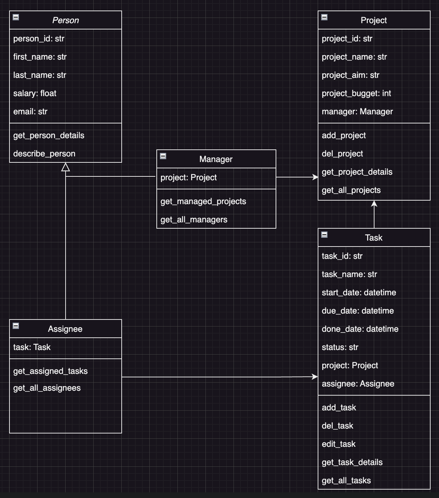
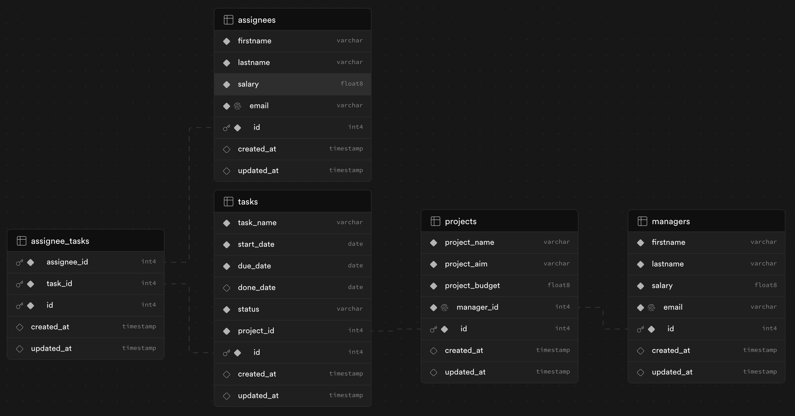

# Project Management App
## Description
This Project Management App is a simple web-based application built using Python, SQLAlchemy and Streamlit. The app 
allows users to manage projects, tasks, and assignees. It supports basic operations such as creating database tables, 
seeding the database with initial data, and performing CRUD (Create, Read, Update, Delete) operations on the data 
using SQLAlchemy Object Relational Mapper. The app features one-to-one, one-to-many, and many-to-many relationships 
among the entities.
## Features
- Create Database: Automatically generate the database schema based on defined SQLAlchemy models.
- Seed Database: Populate the database with initial dummy data, including projects, managers, tasks and assignees.
- CRUD Operations: Perform operations such as creating, reading, updating, and deleting projects, managers, tasks, 
and assignees.
- One-to-One Relationship: Between Project and Manager with cascading deletes.
- One-to-Many Relationship: Between Project and Task.
- Many-to-Many Relationship: Between Task and Assignee.
- Streamlit Interface: A user-friendly interface for interacting with the database.
## Installation
1. Clone the Repository
```
git clone https://github.com/audrbar/py-task-mng.git
cd project-management-app
```
2. Create and Activate a Virtual Environment
```
python3 -m venv venv
source venv/bin/activate
```
On Windows use `venv\Scripts\activate`
3. Install Dependencies
```
pip install -r requirements.txt
```
4. Set Up Environment Variables<br>Create a .env file in the root directory with the following content:<br>
```
dbname=your_db_name
user=your_db_user
password=your_db_password
host=your_db_host
port=your_db_port
```
5. Run the App:
```
streamlit run app.py
```
## Usage
- **Drop All Tables:** This operation will drop all tables from the database. Uncomment the relevant lines in the main 
function to enable this functionality.
- **Create Tables:** This operation will create all necessary tables as defined in the SQLAlchemy models. This is 
enabled by default in the main function.
- **Seed Database:** Populate the database with initial dummy data. Uncomment the relevant lines in the main function 
to enable this functionality.
- **Explore App Features:** Perform operations such as creating, reading, updating, and deleting projects, managers, 
tasks and assignees.
## Code Structure
- `app.py`: The main Streamlit application file.
- `models.py`: Contains the SQLAlchemy models for `Project`, `Manager`, `Task`, and `Assignee`.
- `database.py`: Contains functions to create, drop, and seed the database.
- `requirements.txt`: Lists the Python dependencies required to run the app.
- `.env`: Environment file for storing database credentials.
## Data Sources
For testing purposes the initial data set may be used:

| File Name       | Source                                | Source Link                   |
|-----------------|---------------------------------------|-------------------------------|
| initial_data.py | Some Demo Data for Project Management | [LINK](./src/initial_data.py) |
## Class Diagram
Class Diagram was used to orchestrate the classes:

## DataBase Diagram
Database Diagram was used to construct the database structure:

## Running tests
_There are tests writen for connection testing in [test directory](./data/test_conn.py). You can run it in console by command:_
`pytest`
## Project status
Way forward:
- Improve Error handling.
- Implement State Management.
- Enhance analytics with more charts.
## Contributing
Contributions are welcome! Please open an issue or submit a pull request if you have any improvements or bug fixes.
## License
This project is licensed under the MIT License.
