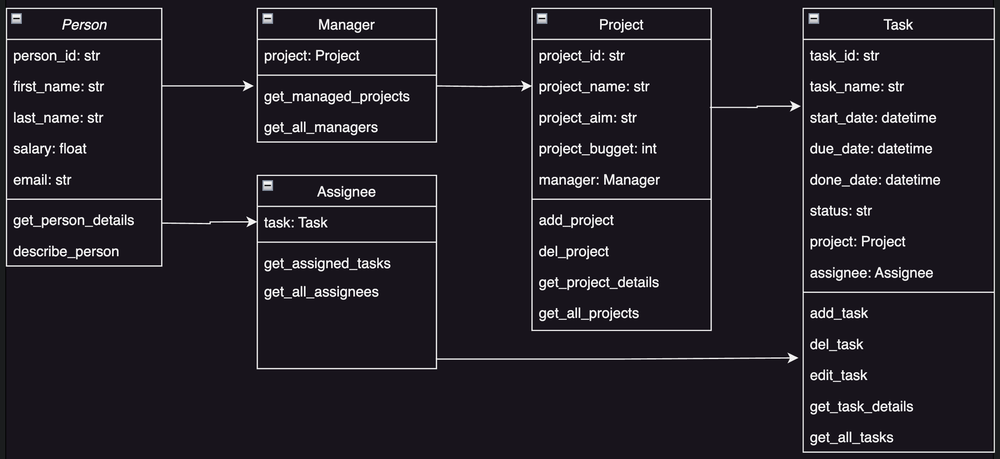
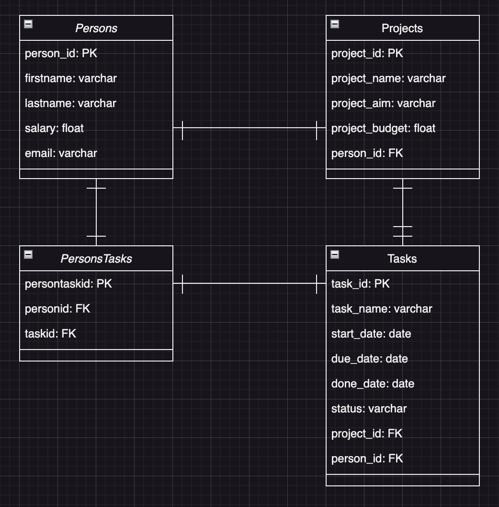

# Project Management App
## Description
This Project Management App is a simple web-based application built using Python, SQLAlchemy and Streamlit. The app
allows users to manage projects, tasks, and assignees. It supports basic operations such as creating database tables,
seeding the database with initial data, and performing CRUD (Create, Read, Update, Delete) operations on the data
using SQLAlchemy Object Relational Mapper. The app features one-to-one, one-to-many, and many-to-many relationships
among the entities.
## Features
- Create Database: Automatically generate the database schema based on defined SQLAlchemy models.
- Seed Database: Populate the database with initial dummy data, including projects, managers, tasks and assignees.
- CRUD Operations: Perform operations such as creating, reading, updating, and deleting projects, managers, tasks,
and assignees.
- One-to-One Relationship: Between Project and Manager with cascading deletes.
- One-to-Many Relationship: Between Project and Task.
- Many-to-Many Relationship: Between Task and Assignee.
- Streamlit Interface: A user-friendly interface for interacting with the database.
## Installation
1. Clone the Repository
    ```
    git clone https://github.com/audrbar/py-task-mng.git
    cd py-task-mng
    ```
2. Create and Activate a Virtual Environment
    ```
    python3 -m venv venv
    source venv/bin/activate
    ```
    On Windows use
    ```
    venv\Scripts\activate
    ```
3. Install Dependencies
    ```
    pip install -r requirements.txt
    ```
4. Set Up Environment Variables<br>Create a .env file in the root directory with the following content:<br>
    ```
    dbname=your_db_name
    user=your_db_user
    password=your_db_password
    host=your_db_host
    port=your_db_port
    ```
5. Run the App:
    ```
    streamlit run Home.py
    ```
## Usage
Open `db_seed.py` file, run `main()` function and type the number corresponding to the action you want to perform and
press Enter:
- **Option 1:** `Drop all tables in the database` This option will delete all the tables in the database. After
selecting this option, all existing tables will be dropped from the database. Use this option if you want to start
fresh or reset the database schema.
- **Option 2:** `Create database tables Model provides` This option will create the database tables as defined
by your ORM models. After selecting this option, the database tables will be created based on the models
defined in your code. Use this option to set up the database structure.
- **Option 3:** `Seed database with dummy data` This option will populate the database with dummy data,
which is useful for testing or development purposes. After selecting this option, the database will be filled with
predefined sample data.
- **Option 4:** `Just exit` This option will exit the script without making any changes to the database. If you choose
this option, the script will close the session and terminate.
- **Explore App Features:** Perform operations such as creating, reading, updating, and deleting projects, managers,
tasks and assignees. The script ensures that the database session is properly closed after any operation, ensuring
no resources are left hanging.
## Code Structure
- `Home.py`: The main Streamlit application file.
- `models.py`: Contains the SQLAlchemy models for `Project`, `Manager`, `Task`, and `Assignee`.
- `database.py`: Contains functions to create, drop, and seed the database.
- `requirements.txt`: Lists the Python dependencies required to run the app.
- `.env`: Environment file for storing database credentials.
## Data Sources
For testing purposes the initial data set may be used:

| File Name       | Source                                | Source Link                 |
|-----------------|---------------------------------------|-----------------------------|
| initial_data.py | Some Demo Data for Project Management | [LINK](./src/dummy_data.py) |
## Class Diagram
Class Diagram was used to design the classes:

## DataBase Diagram
Database Diagram was used to design the database structure:

## Running tests
There are tests writen for connection, functions and dataframe testing in [tests directory](./tests).
You can run it in console by command:
   ```
   python -m unittest discover -s tests
   ```
or
   ```
   pytest
   ```
## Pre-Commit Hooks
This project uses pre-commit hooks to enforce code quality and style guidelines before changes are committed.
Trailing Whitespace Removal, End of File Fixer, YAML Syntax Check, Large File Check, Python Docstring Style Check,
Static Type Checking with MyPy hooks are configured in [pre-commit-config.yaml](./.pre-commit-config.yaml) file.<br>
To install and use these hooks, make sure you have pre-commit installed. You can install it via pip:
   ```
   pip install pre-commit
   ```
Then, set up the hooks by running:
   ```
   pre-commit install
   ```
To run pre-commit:
   ```
   pre-commit run --all-files
   ```
## Project status
Way forward:
- Improve Error handling.
- Implement State Management.
- Enhance analytics with more charts.
## Contributing
Contributions are welcome! Please open an issue or submit a pull request if you have any improvements or bug fixes.
## License
This project is licensed under the MIT License.
